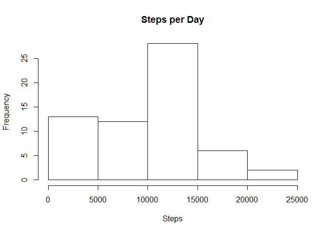
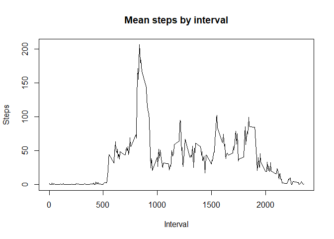
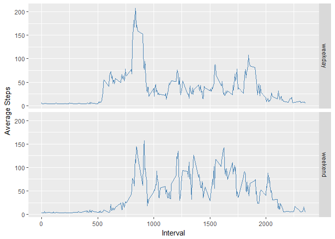

## Introduction

It is now possible to collect a large amount of data about personal movement using activity monitoring devices such as a Fitbit, Nike Fuelband, or Jawbone Up. These type of devices are part of the "quantified self" movement -- a group of enthusiasts who take measurements about themselves regularly to improve their health, to find patterns in their behavior, or because they are tech geeks. But these data remain under-utilized both because the raw data are hard to obtain and there is a lack of statistical methods and software for processing and interpreting the data.

This assignment makes use of data from a personal activity monitoring device. This device collects data at 5 minute intervals through out the day. The data consists of two months of data from an anonymous individual collected during the months of October and November, 2012 and include the number of steps taken in 5 minute intervals each day

## Loading the Data


```r
unzip("activity.zip")
data <- read.table("activity.csv",header=T, quote="\"", sep=",", na.strings="NA")
```


## What is mean total number of steps taken per day?

### Histogram of steps per day

```r
stepsperday <- tapply(data$steps, data$date, sum, na.rm=TRUE)
hist(stepsperday,xlab="Steps", main="Steps per Day")
```

<!-- -->

### Median and mean steps per day

```r
meanDailySteps <- mean(stepsperday)
medianDailySteps <- median(stepsperday)
```

The mean number of daily steps is 9354.2295082.  
The median number of daily steps is 10395.


## What is the average daily activity pattern?

### Plot of mean daily steps by time interval

```r
stepsByInterval <- aggregate(steps ~ interval, data=data,FUN="mean")
plot(stepsByInterval$interval, stepsByInterval$steps, type="l", xlab="Interval",ylab="Steps",main="Mean steps by interval")
```

<!-- -->

### Which interval contains the maximum steps?

```r
maxStepInterval <- stepsByInterval[which.max(stepsByInterval$steps),]
```

The time interval with the maximum daily steps is 835


## Imputing missing values

### Total Missing Values

```r
nacount <- sum(is.na(data$steps))
```

There are a total of 2304 rows with missing data for steps.

### Impute the missing values and create new complete data set

```r
library(mice)
impData <- mice(data, maxit=10,method="norm.predict")
completeData <- complete(impData,action=1)
```

### Histogram of complete daily total steps

```r
cstepsperday <- tapply(completeData$steps, completeData$date, sum, na.rm=TRUE)
hist(cstepsperday,xlab="Steps", main="Steps per Day")
```

<!-- -->

### Calculate mean and median for new data set

```r
cmeanDailySteps <- round(mean(cstepsperday), digits=4)
cmedianDailySteps <- median(cstepsperday)
```

The mean daily steps for the complete data set is 10716.97 and the median is 10395. Imputing the missing data using predictive linear regression has increased the mean and median daily steps.  

I also tried a variety of other imputation methods and all increased the mean and median by similar amounts, so I opted to use this method instead of other methods which were more likely to preserve the mean and medians.


## Are there differences in activity patterns between weekdays and weekends?

Use the timeDate library to create another factor column on the completeData indicating whether the day is a weekday or a weekend.


```r
library(timeDate)
completeData$date <- as.Date(completeData$date)
completeData$day.type <- "weekday"
weekends <- isWeekend(completeData$date)
completeData$day.type[weekends] <- "weekend"
completeData$day.type <- as.factor(completeData$day.type)
```

Now we can plot the steps by time interval separating weekdays and weekends.

```r
library(ggplot2)
cstepsByInterval <- aggregate(steps ~ interval + day.type, data=completeData,FUN="mean")
ggplot(cstepsByInterval,aes(x= interval, y=steps)) + geom_line(color="steelblue") + facet_grid(day.type ~ .) + labs(x="Interval", y="Average Steps")
```

<!-- -->
